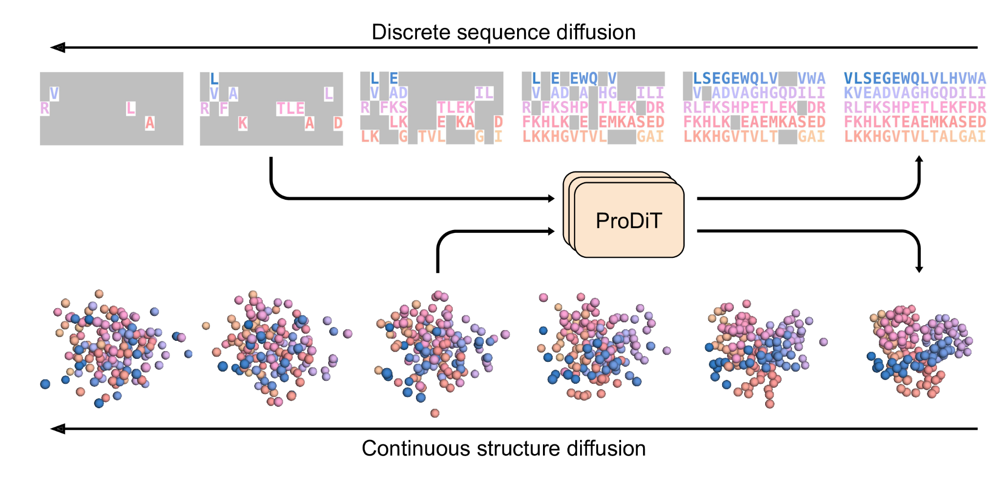

# ProDiT

Implementation of [**Generating proteins with computationally predicted functions and multiple states via multimodal diffusion**](https://www.biorxiv.org/content/10.1101/2025.09.03.672144) (*Nature Machine Intelligence*, 2026) by Bowen Jing*, Anna Sappington*, Mihir Bafna, Ravi Shah, Adrina Tang, Rohith Krishna, Adam Klivans, Daniel J. Diaz, and Bonnie Berger.

ProDiT is a multimodal diffusion transformer that jointly generates protein sequence and structure via discrete and continuous diffusion, respectively. Given a target molecular function or multistate design objective, ProDiT can be conditioned on Gene Ontology terms or guided with a multistate sampling protocol to design proteins with the desired behavior. Please see our preprint for detailed methodology and benchmarks.

> [!NOTE]
> This repository is provided for _in silico_ research reproducibility. It does not yet provide an end-to-end design workflow with _in vitro_ experimental validation.



## Installation

In a Conda environment with python 3.12, install the following dependencies
* biopython
* biopandas
* numpy==1.26.4
* torch==2.2.0
* pytorch-lightning==2.4.0
* dm-tree
* omegaconf
* fair-esm
* neptune
* einops
* scipy==1.14.1
* transformers
* modelcif
* TMscore

To run all evaluation metrics, you will need to also install the Genie2 evaluation pipeline (forked at https://github.com/bjing2016/insilico_design_pipeline) **in a separate conda environment named `eval`** and placed in the same directory that this repository is located in, i.e.,

```
├── insilico_design_pipeline
└── prodit
```

The Genie2 pipeline depends on OpenFold. Because OpenFold can be tricky to install, we recommend installing it manually, running the pipeline installation with `--no-deps`, and resolving missing packages manually.

## Weights

The model weights are provided at 

* 576M-parameter model https://storage.googleapis.com/prodit/576M.ckpt
* 321M-parameter model https://storage.googleapis.com/prodit/321M.ckpt

The inference scripts expect these checkpoints in the repository root.

## Inference

We provide config files to easily reproduce the model inference presented in the paper. All configs assume a machine with 8 GPUs, which can be changed with `--devices`.

**Unconditional structure generation**
```
python train.py --config experiments/struct_gen/config.yaml
```

**Unconditional sequence generation**
```
python train.py --config experiments/seq_gen/config.yaml
```

**Unconditional co-generation**
```
python train.py --config experiments/codesign/config.yaml
```

**GO term conditioning (all 915 terms)**
```
python train.py --config experiments/function/config.yaml
```

**Carbonic anhydrase multistate scaffolding**
```
python train.py --config experiments/carbonic_anhydrase/config.yaml
```


**Lysozyme multistate scaffolding**
```
python train.py --config experiments/lysozyme/config.yaml
```
